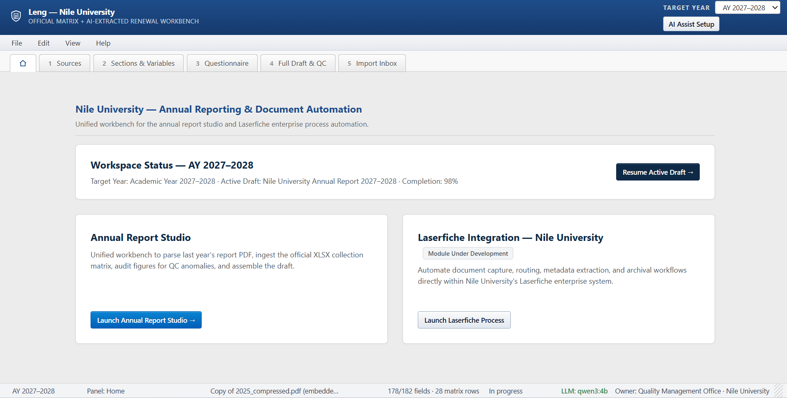
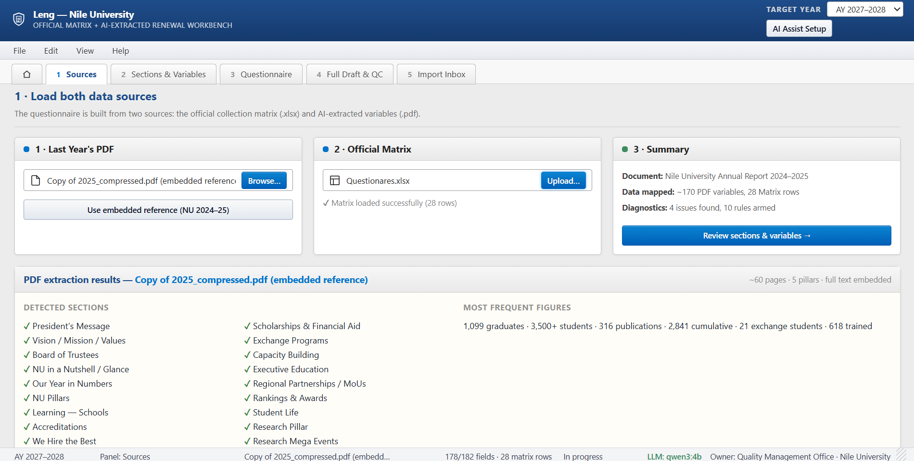
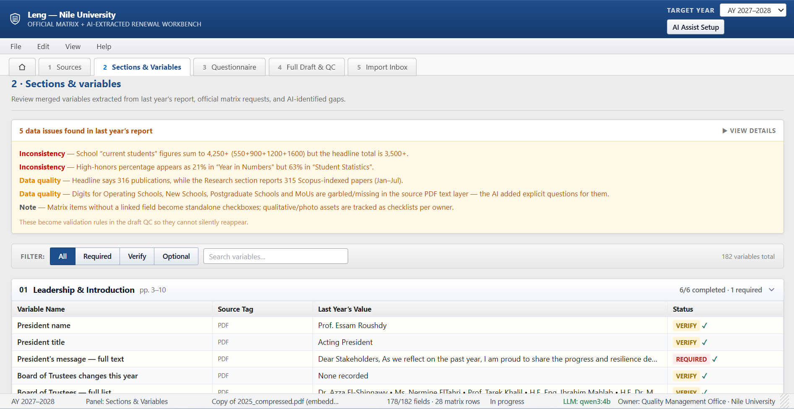
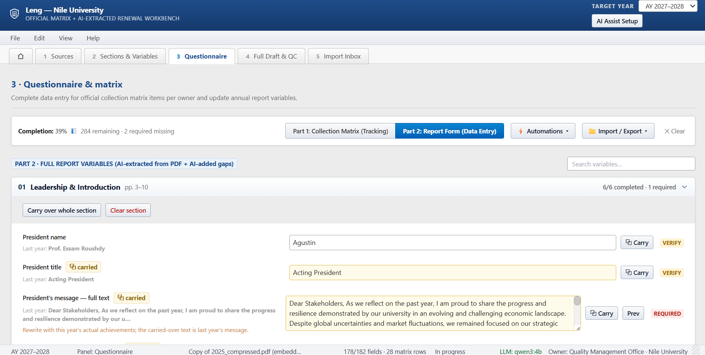
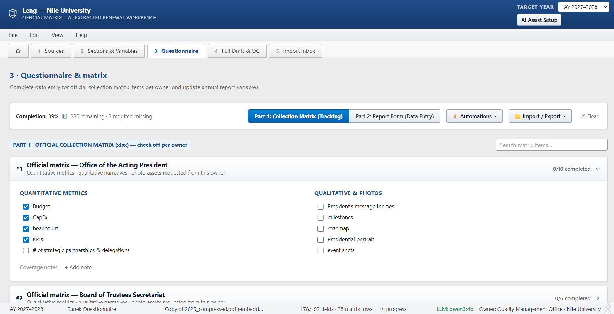
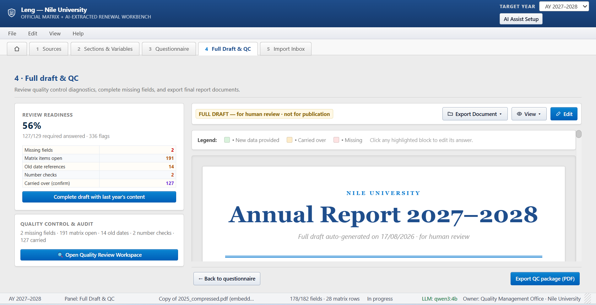
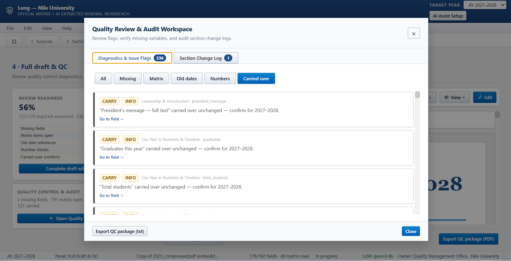
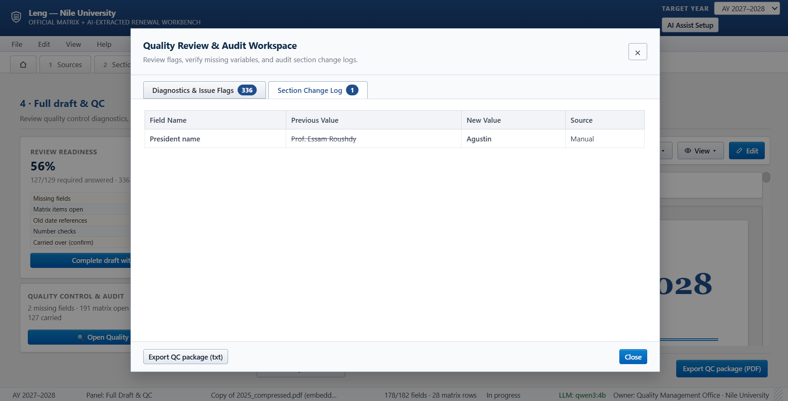
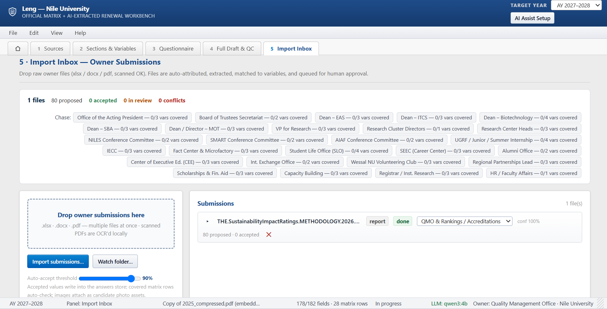
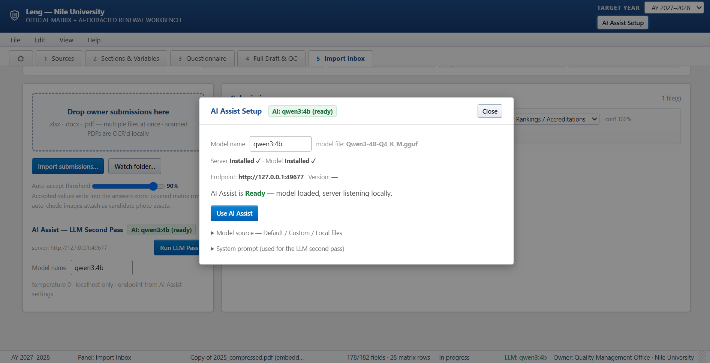

<div align="center">


# 🎓 Leng - Annual Report Studio

**The annual report renewal workbench for Nile University's QMO.**
Turn a pile of owner submissions into a polished, accreditation-ready annual report - powered by a local AI that reads, extracts, and verifies everything for you.

[](https://github.com/Zeyadistired/Leng/releases/latest)
[](https://www.electronjs.org/)
[](#)
[](https://github.com/ggml-org/llama.cpp)
[](LICENSE)

**Download the ready-to-run installer → [Latest Release](https://github.com/Zeyadistired/Leng/releases/latest)**

> 💡 If the latest release gives you trouble, try the **previous release** (one behind) instead - it's always kept available below the latest one.

</div>

---

## ✨ What is it?

Leng is a **desktop app that builds NU's annual self-study report** from raw owner submissions (PDFs, Excels, Word docs). It runs **100% offline-first**:

- 📥 **Import Inbox** - drop files in a watched folder and walk through scored, provenanced extraction proposals (`conf ≥ 90%` auto-accept, 60–89% → review)
- 🧠 **Local AI** - a bundled `llama.cpp` server runs **Qwen3 (1.7B / 4B)** on your machine; no cloud, no API keys, no uploads
- 🗂 **182 variables across 20 sections** - a typed data model (`text / long / num / pct`, `required / verify / optional`) mirroring the printed report
- ✅ **Auto questionnaire & QC** - 8-owner matrix consistency checks, carry-forward of last year's values, readiness score, and 5-class issue report (missing / matrix / old date / inconsistency / carry)
- 🖨 **Accreditation-grade exports** - Markdown, HTML, styled DOCX, print, A4 PDF, and an audit-ready QC package of every import decision

## 🖼 Screenshots

<div align="center">

| | | |
|---|---|---|
|  |  |  |
|  |  |  |
|  |  |  |
|  | | |

</div>

## 🚀 Getting started

### Option A - just use it (no install steps beyond one file)

1. Grab **`Leng Setup 1.0.0.exe`** from the [latest release](https://github.com/Zeyadistired/Leng/releases/latest)
2. Run the installer - done
3. On first launch the app offers to download a small AI model (~1.1 GB Qwen3 1.7B) - or skip it and work manually

### Option B - run from source

```bash
npm install
npm start        # launch in dev mode
npm run dist     # build the Windows installer (outputs to dist/)
npm run portable # build the portable exe variant
```

## 🧠 How the AI works

| Piece | Detail |
|---|---|
| Server | `llama-server` (llama.cpp b10331) spawned locally, auto-downloaded + SHA-256 verified |
| Models | Qwen3-1.7B-Q4_K_M (`~1.1 GB`, ≈8.5 s/item) or Qwen3-4B-Q4_K_M (`~2.5 GB`, ≈15 s/item) |
| Flags | `--reasoning off` (kills hidden-reasoning latency, **11× faster**), `--ctx-size 2048`, `--parallel 2`, flash-attention |
| QC pass | Batches 8 values/request × 2 concurrent, 60 tokens per value, per-batch persistence, live ETA + cancel |
| ML attribution | Local embeddings (all-MiniLM-L6-v2, ONNX/WASM) attribute files to owners (`cos ≥ 0.45`, learns from the last 40 docs) |
| OCR | Scanned PDFs are OCR'd locally via Tesseract WASM - zero cloud calls |

**Everything is self-contained**: model download, checksums, server spawn, model switching (auto-restart), and port selection happen in-app. Settings live in `%APPDATA%\Leng` (macOS: `~/Library/Application Support/Leng`).

## 🏗 The 5-step workflow

```
1 · Sources  → 2 · Sections & Variables  → 3 · Questionnaire  → 4 · Full Draft & QC  → 5 · Export
```

1. **Sources** - pick files or watch a folder; every accepted value keeps provenance `{file, ref, page, conf, type, at}`
2. **Sections** - 20 sections, 182 variables, carry-forward, manual overrides
3. **Questionnaire** - matrix auto-checks and owner-level consistency
4. **Full Draft & QC** - readiness %, 5 issue classes, full change log, AI review pass
5. **Export** - MD · HTML · DOCX · print · A4 PDF · QC package

## 🛠 Tech stack

- **Electron 43** - desktop shell (main / preload / renderer, nodeIntegration)
- **Vanilla JS** in `app.html` (~3,000 lines, zero framework) + Tailwind
- **pdf.js, SheetJS (xlsx), mammoth, docx (JS), Tesseract.js, transformers.js** - all pure JS/WASM, all offline
- **llama.cpp** - local inference via pinned release + SHA-256 verification

```
AnnualReportStudio/
├─ app.html      # the whole UI + logic (sections, imports, LLM pass, AI panel)
├─ main.js       # windows, launcher, IPC, exports, AI server lifecycle
├─ preload.js    # window.api bridge
├─ lib/          # ai.js (server bootstrap) · store.js · unzip.js
└─ libs/         # vendored engines: pdf, xlsx, docx, mammoth, tesseract, transformers
```

## 📦 Releases

Every release ships a ready-to-run installer **plus** a full source snapshot:

| Tag | Notes |
|---|---|
| [v1.0.2](https://github.com/Zeyadistired/Leng/releases/tag/v1.0.2) | Batched AI QC pass, reasoning-off (11× faster), 1.7B model option, ETA + cancel |
| [v1.0.1_source](https://github.com/Zeyadistired/Leng/releases/tag/v1.0.1_source) | Earlier snapshot |
| [v1.0.0](https://github.com/Zeyadistired/Leng/releases/tag/v1.0.0) | First public build |

## 🤝 Contributing

Built for Nile University's QMO. Found a bug, or want a feature (e.g. **macOS build - in progress**)? Open an issue or a PR.

---

<div align="center">

**Leng · Nile University Quality Management Office** 🦅

</div>
